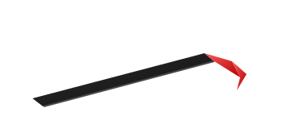
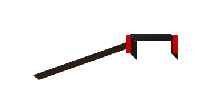
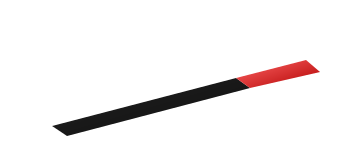
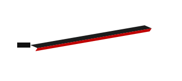
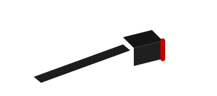
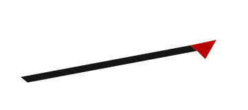

# Break The Room - Tool Hit Face Design

## Goal
Define **hit faces** per tool so impact only counts when the tool is used correctly (direction + contact area), instead of any collider touching the target.

This supports skill-based swings:
- sword must cut with edge,
- hammer must strike with hammer head face,
- crowbar must hit with hook/beak or prying edge,
- etc.

---

## Hit Face Rules (Global)

Each tool should declare one or more `HitFaceZones`, each with:
- `zoneId`
- `shape` (box/sphere/capsule)
- `localPose` (position/rotation relative to tool root)
- `allowedImpactDir` (dot-product gate vs velocity/contact normal)
- `minSpeed`
- `damageMultiplier`
- `impulseMultiplier`
- `damageType` (blunt, slash, pierce, pry, explosive)

Validation order per hit:
1. Contact is inside at least one active `HitFaceZone`.
2. Relative velocity exceeds `minSpeed`.
3. Impact direction satisfies zone directional gate.
4. Apply damage profile for that zone.

Fallback (optional):
- Off-face contacts can apply tiny glancing damage (5-15%) or none.

---

## Existing Tools

### Hit Face Visuals

Legend:
- **Red** = active hit face
- **Black** = non-hit / low-effect body

| Tool | Outline |
|---|---|
| Crowbar |  |
| Hammer |  |
| Bat |  |
| Sword |  |
| Axe |  |
| Spear |  |

### Crowbar
- **Primary hit faces**:
  - Hook tip / beak (focused impact)
  - Inner hook curve (pull/pry impact)
  - Flat shaft edge (low damage)
- **Required movement**:
  - Forward hooking motion or downward chop with hook leading.
- **Damage profile**:
  - Hook tip: medium blunt + pry bonus vs joints/support links.
  - Shaft: low blunt.

### Hammer (Sledge/Heavy Hammer)
- **Primary hit faces**:
  - Front striking face (main)
  - Rear striking face (if double-faced)
  - Side of head (reduced)
- **Required movement**:
  - Face-forward arc swing, head-first impact.
- **Damage profile**:
  - Face: high blunt, high impulse.
  - Side: medium blunt.
  - Handle: minimal.

### Bat / Pipe (if used as base melee)
- **Primary hit faces**:
  - Distal barrel/outer third.
- **Required movement**:
  - Lateral swing with barrel leading.
- **Damage profile**:
  - Barrel: medium blunt + knockback.
  - Handle: low blunt.

---

## New Tools (Planned/Future)

### Sword / Katana
- **Primary hit faces**:
  - Blade edge (left/right)
  - Optional tip for thrust
- **Required movement**:
  - Cutting: edge tangent motion across target.
  - Thrust: tip-forward linear motion.
- **Damage profile**:
  - Edge: high slash, low impulse.
  - Tip: high pierce, low area.
  - Flat blade: very low blunt.

### Axe / Fire Axe
- **Primary hit faces**:
  - Blade edge arc
  - Poll/back face (small blunt zone)
- **Required movement**:
  - Edge-first diagonal/downward chop.
- **Damage profile**:
  - Edge: very high cut + split bonus on wood.
  - Poll: medium blunt.

### Pickaxe / Mattock
- **Primary hit faces**:
  - Pick tip
  - Adze edge (if present)
- **Required movement**:
  - Tip-first downward strike.
- **Damage profile**:
  - Tip: high pierce + structure penetration.
  - Adze: medium cut/blunt hybrid.

### Spear / Polearm
- **Primary hit faces**:
  - Tip thrust zone
  - Blade edge (if glaive/halberd)
- **Required movement**:
  - Forward thrust for tip hits.
  - Sweep for blade edge hits.
- **Damage profile**:
  - Tip: pierce.
  - Edge: slash.
  - Shaft: very low blunt.

### Machete / Cleaver
- **Primary hit faces**:
  - Forward edge half
  - Spine (glancing only)
- **Required movement**:
  - Wrist-led slicing/chopping.
- **Damage profile**:
  - Edge: strong slash.
  - Spine: low blunt.

### Wrench
- **Primary hit faces**:
  - Open-end jaw
  - Ring-end head
- **Required movement**:
  - Head-leading tap/club swing.
- **Damage profile**:
  - Head: medium blunt.
  - Handle: low blunt.

### Shovel
- **Primary hit faces**:
  - Blade front edge
  - Back plate (broad blunt)
- **Required movement**:
  - Spade-edge chop or broad slap.
- **Damage profile**:
  - Edge: medium cut/blunt.
  - Plate: medium blunt, broad area.

### Chainsaw (if added)
- **Primary hit faces**:
  - Moving chain segment only
- **Required movement**:
  - Chain contact with sustained overlap.
- **Damage profile**:
  - Continuous cut over time, low impulse.

### Drill
- **Primary hit faces**:
  - Bit tip / bit shaft
- **Required movement**:
  - Tip-first pressure with spin active.
- **Damage profile**:
  - Continuous pierce, strong on supports.

### Riot Shield / Door Slab (improvised)
- **Primary hit faces**:
  - Leading flat face
  - Bottom edge ram
- **Required movement**:
  - Forward shove/charge.
- **Damage profile**:
  - Low damage, high impulse/knockback.

### Knife / Dagger
- **Primary hit faces**:
  - Edge (slash)
  - Tip (stab)
- **Required movement**:
  - Fast short cuts or thrust.
- **Damage profile**:
  - High precision damage, low impulse.

### Flail / Mace
- **Primary hit faces**:
  - Mace head/body only
- **Required movement**:
  - Head-first pendulum impact.
- **Damage profile**:
  - Very high blunt impulse, chaotic rebound.

### Explosive Charge (non-swing tool)
- **Primary hit face**:
  - N/A (proximity blast sphere)
- **Required movement**:
  - Placement + detonation.
- **Damage profile**:
  - Radial structural damage.

---

## Suggested Data Schema

Use a `ScriptableObject` per tool type:

```csharp
ToolHitFaceProfile
  toolId
  defaultDamageType
  zones[]
    zoneId
    colliderShape
    localPosition
    localRotation
    localScale
    minSpeed
    allowedDirectionAxis
    minDot
    damageMultiplier
    impulseMultiplier
    structuralBonus
```

This keeps content authoring easy and allows future tools without code changes.

---

## Balancing Guidelines

- Make the intended face deal **70-100%** damage.
- Make off-face contacts deal **0-25%**.
- Require slightly higher `minSpeed` for precision tools (sword/axe tip).
- Give blunt tools (hammer/mace) bigger active zones and higher impulse.
- Give pry tools (crowbar/pick) extra bonus vs `StructuralLink`/jointed supports.

---

## Recommended Rollout (Implementation Plan)

1. Add hit-face zones for current 3 tools (crowbar, hammer, bat).
2. Expose debug gizmos for active zones and accepted/rejected hits.
3. Integrate direction checks + speed thresholds.
4. Tune collapse response on shelf/table test rigs.
5. Add sword + axe as first advanced edge-based tools.
